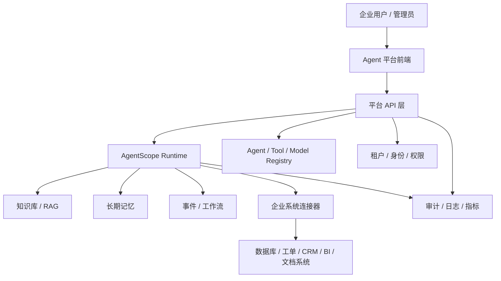

# Enterprise Agent Platform Blueprint

这份蓝图把当前 `enterprise_knowledge_assistant` 示例升级为企业 Agent 平台的落地路线。目标不是再做一个聊天机器人，而是沉淀一套可复用的平台能力：租户、模型、Agent、工具、知识、记忆、工作流、权限和审计。

## 平台定位

企业 Agent 平台应该解决三类问题：

- 业务团队可以创建、配置和使用不同 Agent，例如知识助手、客服助手、数据分析助手、研发助手。
- 平台团队可以统一管理模型、工具、知识库、权限、审计、成本和运行状态。
- 开发团队可以把真实企业系统封装成安全可控的工具，让 Agent 在权限范围内自动完成任务。

当前示例已经验证了第一条最小闭环：一个租户用户可以使用一个企业知识助手，模型能调用租户隔离的企业工具，并把结果写入会话、长期记忆和本地工具审计日志。

## 目标架构

## 核心模块

| 模块 | 要做什么 | 当前示例状态 |
| --- | --- | --- |
| 租户与身份 | 识别用户、租户、部门、角色和数据权限 | 用 `X-User-ID` 演示租户隔离 |
| Agent 管理 | 创建、配置、发布、停用 Agent | 依赖 AgentScope app service |
| 模型管理 | 统一管理模型凭证、参数、默认模型和成本策略 | 已通过服务接口配置凭证 |
| 工具系统 | 把数据库、API、工单、BI、代码执行等能力封装成工具 | 已有政策、工单、指标三个只读工具 |
| 知识库 | 文档上传、切分、索引、检索、引用来源 | 已启用 RAG 服务能力 |
| 长期记忆 | 按用户、Agent、Session 记录偏好和历史上下文 | 已接 `AgenticMemoryMiddleware` |
| 工作流 | 多 Agent 协作、事件驱动、审批、定时任务 | 已有子 Agent 模板，待扩展事件流 |
| 权限与审计 | 工具授权策略、操作日志、trace id、敏感操作拦截 | 只读工具已有本地授权策略和 JSONL 审计，写操作待补审批 |
| 运维观测 | 会话状态、工具耗时、错误率、token 成本 | 待补平台指标与日志面板 |

## MVP 范围

第一版不要追求全平台大而全，先做一个可演示、可扩展的企业内部门户：

1. 管理员能配置模型凭证和默认模型。
2. 管理员能配置企业知识助手，并把它发布给一个租户。
3. 用户打开前端后能选择助手、创建会话、提问。
4. Agent 能调用租户隔离的企业工具。
5. Agent 能使用长期记忆。
6. Agent 能查询知识库或结构化企业数据，并在回答里说明来源。
7. 平台能记录每次会话、工具调用、错误和来源。

## 当前示例对应的产品形态

当前 `enterprise_knowledge_assistant` 可以作为平台里的第一个内置 Agent：

- Agent 名称：企业知识助手
- 面向用户：企业员工、IT 支持、工程团队、运营团队
- 可用能力：查政策、查工单、查部门指标、读知识库、记住会话上下文
- 数据来源：本地 mock JSON，后续可替换成 HTTP 网关、数据库、工单系统、Wiki 或文档库

## 推荐迭代顺序

### 第 0 阶段：演示闭环

- 保留当前知识库 mock 数据。
- 已增加 `scripts/start_enterprise_agent_platform.sh`，一条命令启动 Redis、后端和前端。
- 已在 README 写清楚演示账号、演示问题、数据文件位置。
- 已增加本地工具调用审计日志。
- 已增加默认/租户/用户三层工具授权策略。
- 验证浏览器里能完成一次完整问答。

验收标准：非开发人员按文档能在 5 分钟内跑通企业知识助手。

### 第 1 阶段：平台骨架

- 前端增加平台入口：Agent 列表、会话列表、模型配置入口、知识库入口。
- 后端保留 AgentScope app service，外层增加企业平台配置层。
- 抽象平台配置：租户、Agent 模板、工具授权、默认模型、默认知识库。
- 把当前 `X-User-ID` 替换成更接近真实系统的登录态适配层。

验收标准：同一个平台里能承载至少两个 Agent，并能按租户显示不同配置。

### 第 2 阶段：真实企业系统接入

- 把 `MockEnterpriseConnector` 换成 HTTP 或数据库 connector。
- 接入至少一个真实系统，例如工单、知识库、CRM、BI 或内部用户目录。
- 把本地 JSONL 工具审计换成平台数据库或日志系统。
- 对写操作工具加入审批或二次确认，并把审批结果写入审计链路。

验收标准：Agent 能读取一个真实企业系统，并且每次工具调用可追溯。

### 第 3 阶段：工作流与多 Agent

- 用子 Agent 模板拆分角色，例如政策研究员、工单处理员、数据分析员。
- 加入事件机制，把会话事件、工具事件、审批事件和外部系统事件串起来。
- 支持半自动流程：Agent 先生成执行计划，用户确认后再执行。

验收标准：平台能完成一个跨系统任务，例如“分析工单趋势，生成处理建议，并创建待审批行动项”。

### 第 4 阶段：生产化

- Redis、Qdrant、Blob Store 改成生产级部署。
- 增加限流、成本控制、敏感词与敏感数据脱敏。
- 增加监控面板：会话量、失败率、工具调用量、模型成本、知识库索引状态。
- 建立发布流程：Agent 草稿、测试、灰度、上线、回滚。

验收标准：平台能给多个部门使用，并具备权限、审计、监控和回滚能力。

## 下一步开发清单

启动脚本、5 分钟演示文档、本地工具审计和工具授权策略已经补上。接下来建议马上做这四件事：

1. 完善平台首页：Agent 列表、最近会话、模型状态、知识库状态、审计入口。
2. 给前端准备默认开发配置：默认 API endpoint、默认用户、默认演示问题。
3. 把 `企业知识助手` 抽成平台内置 Agent 模板，为客服助手、数据分析助手复用同一套配置方式。
4. 接一个真实企业系统，先从工单、知识库、CRM、BI 或内部用户目录里选一个。

这四件事完成后，当前示例就会从“能演示的平台雏形”继续往“可管理的企业 Agent 平台”推进。
